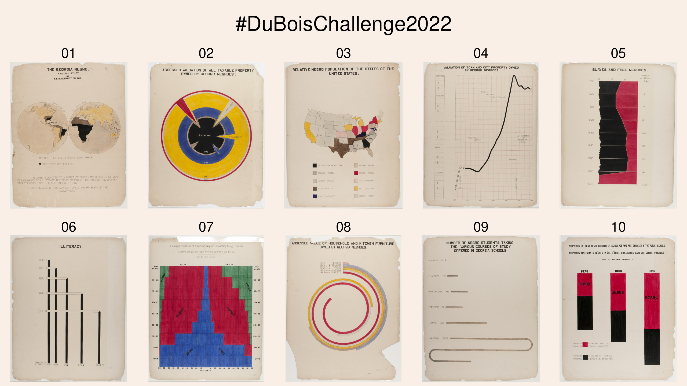

# Du Bois Visualization Challenge: 2022



The goal of the challenge is to celebrate the data visualization legacy of W.E.B Du Bois by recreating the visualizations from the 1900 Paris Exposition using modern tools.

This directory contains the data and original plates from the exposition; your goal is to re-create
the visualizations using modern tools of your choice (Tableau, R, ggplot, Stata, PowerBI, decksh, etc)

There is a folder for each challenge, which includes the images of the 1900 original plates along with the corresponding data. You may submit your re-creations to twitter using the hash tag ```#DuBoisChallenge2022```

## The Challenges

* challenge01: The Georgia Negro (plate 1)
* challenge02: Assessed Valuation of all Taxable Property Owned by Georgia Negroes (plate 22)
* challenge03: Relative Negro Population of the States of the United States (plate 2)
* challenge04: Valuation of Town and City Property Owned by Georgia Negroes (plate 21)
* challenge05: Slave and Free Negroes (plate 12)
* challenge06: Illiteracy (plate 14)
* challenge07: Conjugal condition of American Negroes according to age periods (plate 53)
* challenge08: Assessed Value of Household and Kitchen Furniture Owned by Georgia Negroes. (plate 25)
* challenge09: Number Of Negro Students Taking The Various Courses Of Study Offered In Georgia Schools (plate 17)
* challenge10: Proportion Of Total Negro Children Of School Age Who Are Enrolled In The Public Schools (plate 49)

## References

To learn about how I re-created the visualizations using [decksh](https://speakerdeck.com/ajstarks/decksh-a-little-language-for-decks), see: [Recreating the Dubois Data Portraits](https://speakerdeck.com/ajstarks/recreating-the-dubois-data-portraits). This presentation contains the full catalog of re-creations at the end.

Also, here is a quick guide to the ["Duboisian" style](https://github.com/ajstarks/dubois-data-portraits/blob/master/dubois-style.pdf).

