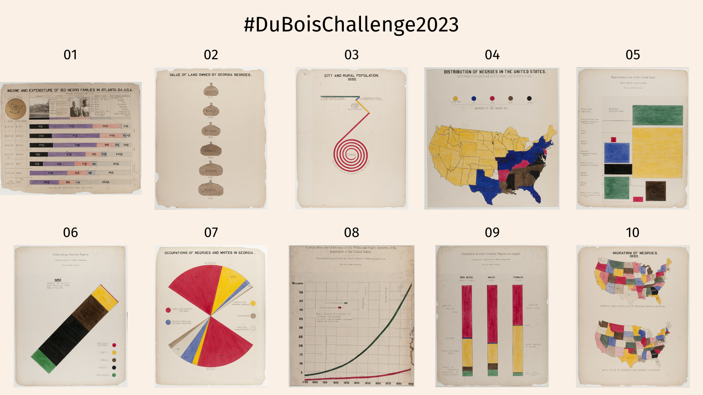

# Du Bois Visualization Challenge: 2023



The goal of the challenge is to celebrate the data visualization legacy of W.E.B Du Bois by recreating the visualizations from the 1900 Paris Exposition using modern tools.

This directory contains the data and original plates from the exposition; your goal is to re-create
the visualizations using modern tools of your choice (Tableau, R, ggplot, Stata, PowerBI, decksh, etc)

There is a folder for each challenge, which includes the images of the 1900 original plates along with the corresponding data. You may submit your re-creations to twitter using the hash tag ```#DuBoisChallenge2023```. 

Note that for 2023, we will expanding the challenge to the Data Visualization Society Slack, as well as Mastadon on vis.social

## The Challenges

* challenge01: Income and Expenditure (plate 31)
* challenge02: Value of Land Owned by Georgia Negroes (plate 18)
* challenge03: City and Rural Population 1890 (plate 11)
* challenge04: Distribution of Negroes in the United States (plate 38)
* challenge05: Negro business men in the United States (plate 57)
* challenge06: Crime among American Negroes (plate 60)
* challenge07: Occupations Of Negroes And Whites In Georgia (plate 27)
* challenge08: Comparative rate of increase of the White and Negro elements population of the United States (plate 40)
* challenge09: Occupations in which American Negroes are engaged (plate 43)
* challenge10: Migration of Negroes 1890 (plate 8)

## References

To learn about how I re-created the visualizations using [decksh](https://speakerdeck.com/ajstarks/decksh-a-little-language-for-decks), see: [Recreating the Dubois Data Portraits](https://speakerdeck.com/ajstarks/recreating-the-dubois-data-portraits). This presentation contains the full catalog of re-creations at the end.

Also, here is a quick guide to the ["Duboisian" style](https://github.com/ajstarks/dubois-data-portraits/blob/master/dubois-style.pdf).

