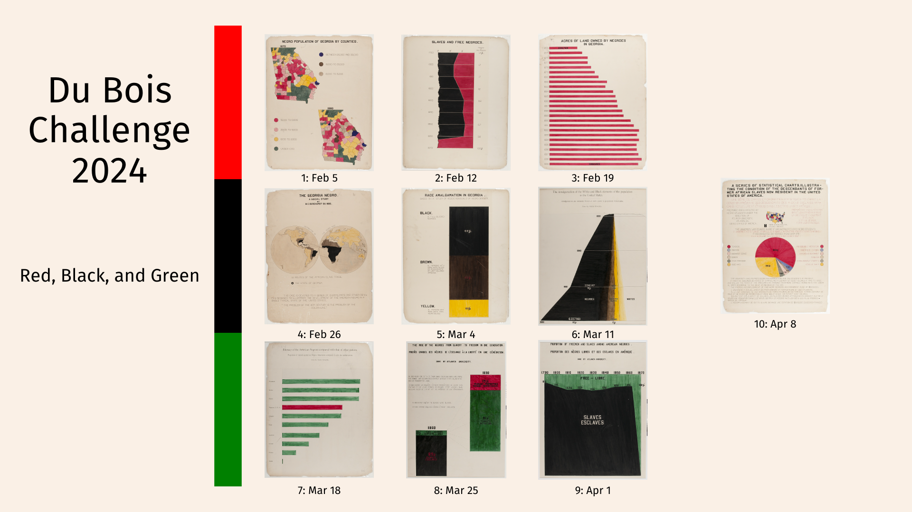

# Du Bois Visualization Challenge: 2024



The goal of the challenge is to celebrate the data visualization legacy of W.E.B Du Bois by recreating the visualizations from the 1900 Paris Exposition using modern tools.

This directory contains the data and original plates from the exposition; your goal is to re-create
the visualizations using modern tools of your choice (Tableau, R, ggplot, Stata, PowerBI, decksh, etc)

There is a folder for each challenge, which includes the images of the 1900 original plates along with the corresponding data. You may submit your re-creations to social media using the hash tag ```#DuBoisChallenge2024```. 

Note that for 2024, the challenge will occur on X (formally Twitter), LinkedIn, Data Visualization Society Slack, Instagram, as well as Mastadon on vis.social.

## Prizes you could win

As a bonus, share your work in the [DVS Slack](https://www.datavisualizationsociety.org/slack-community?utm_source=github&utm_medium=website&utm_campaign=dubois-challenge-2024) for a chance to win either a one-year [DVS Membership](https://www.datavisualizationsociety.org/membership?utm_source=github&utm_medium=website&utm_campaign=dubois-challenge-2024) (valued at $99) or a [Nightingale Magazine](https://shop.datavisualizationsociety.org/) (valued at $40).

There are two awards you could win:

1. Challenge Contributor: Submit your work in the [#challenge-dubois channel](https://datavizsociety.slack.com/?redir=%2Farchives%2FC04N7FZ1S82%3Fname%3DC04N7FZ1S82) to be entered into a raffle to win the prize

2. Top Contributor: Awarded to whoever submits work in the [#challenge-dubois channel](https://datavizsociety.slack.com/?redir=%2Farchives%2FC04N7FZ1S82%3Fname%3DC04N7FZ1S82) for the most weeks (up to all 10) within the challenge period 


Winners are announced at the end of the challenge.

Note: you need to be a DVS Member to log into the DVS Slack. If you need assistance logging into Slack, contact assistant@datavisualizationsociety.org for support.

## The Challenges

This year the theme for the challenge will be organized around the colors of the Pan African flag: Challenges 1-3: red, Challenges 4-6: black, Challenges 7-9: green, Challenge 10: a combination.


### Red
* [challenge01](https://github.com/ajstarks/dubois-data-portraits/tree/master/challenge/2024/challenge01): Negro Population of Georgia by Counties, 1870, 1880  (plate 06), February 5
* [challenge02](https://github.com/ajstarks/dubois-data-portraits/tree/master/challenge/2024/challenge02): Slave and Free Negroes (plate 12), February 12
* [challenge03](https://github.com/ajstarks/dubois-data-portraits/tree/master/challenge/2024/challenge03): Acres of Land Owned by Negroes in Georgia (plate 19), February 19

### Black
* [challenge04](https://github.com/ajstarks/dubois-data-portraits/tree/master/challenge/2024/challenge04): The Georgia Negro (plate 01), February 26
* [challenge05](https://github.com/ajstarks/dubois-data-portraits/tree/master/challenge/2024/challenge05): Race Amalgamation in Georgia (plate 13), March 4
* [challenge06](https://github.com/ajstarks/dubois-data-portraits/tree/master/challenge/2024/challenge06): Amalgamation of the White and Black elements of the population in the United States (plate 54), March 11

### Green
* [challenge07](https://github.com/ajstarks/dubois-data-portraits/tree/master/challenge/2024/challenge07):  Illiteracy of the American Negro compared with other nations (plate 47), March 18
* [challenge08](https://github.com/ajstarks/dubois-data-portraits/tree/master/challenge/2024/challenge08): The Rise of Negroes from Slavery to Freedom in One Generation (plate 50), March 25
* [challenge09](https://github.com/ajstarks/dubois-data-portraits/tree/master/challenge/2024/challenge09): Proportion of Freemen and Slaves  (plate 51), April 1

### Combination
* [challenge10](https://github.com/ajstarks/dubois-data-portraits/tree/master/challenge/2024/challenge10): A Series Of Statistical Charts Illustrating The Conditions Of Descendants Of Formal African Slaves Now Resident In The Unites States (plate 37), April 8

## References

To learn about how I re-created the visualizations using [decksh](https://speakerdeck.com/ajstarks/decksh-a-little-language-for-decks), see: [Recreating the Dubois Data Portraits](https://speakerdeck.com/ajstarks/recreating-the-dubois-data-portraits). This presentation contains the full catalog of re-creations at the end.

Also, here is a quick guide to the ["Duboisian" style](https://github.com/ajstarks/dubois-data-portraits/blob/master/dubois-style.pdf).

