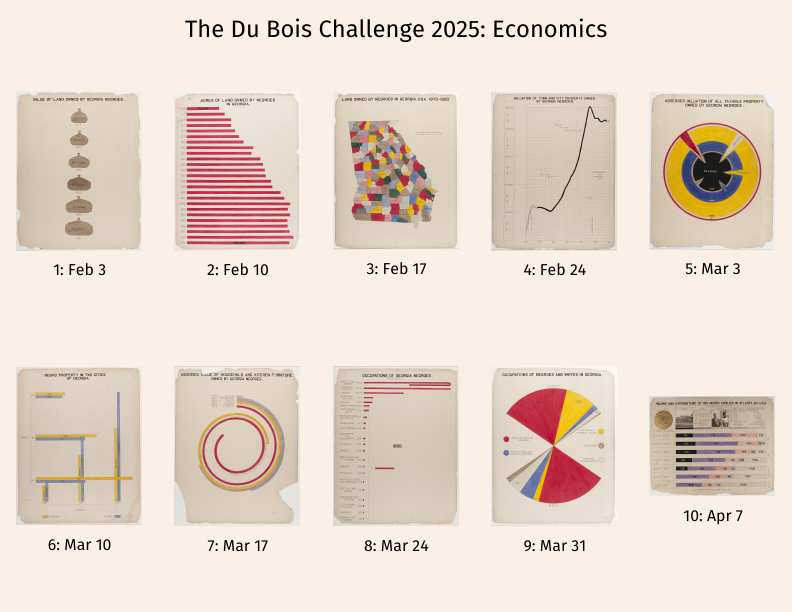

# Du Bois Visualization Challenge: 2025



The goal of the challenge is to celebrate the data visualization legacy of W.E.B Du Bois by recreating the visualizations from the 1900 Paris Exposition using modern tools.

This directory contains the data and original plates from the exposition; your goal is to re-create the visualizations using modern tools of your choice (Tableau, R, ggplot, Stata, PowerBI, decksh, etc)

There is a folder for each challenge, which includes the images of the 1900 original plates along with the corresponding data. You may submit your re-creations to social media using the hash tag ```#DuBoisChallenge2025```. 

Note that for 2025, the challenge will occur on BlueSky, X, LinkedIn, Data Visualization Society Slack, as well as Mastadon on vis.social.

## Collaboration with the Data Visualization Society

As a bonus, share your work in the [DVS Slack]( https://www.datavisualizationsociety.org/slack-community) for a chance to win either a one-year [DVS Membership](https://www.datavisualizationsociety.org/membership) (valued at $99) or a [Nightingale Magazine](https://shop.datavisualizationsociety.org/) (valued at $40).

There are two awards you could win:

1. Challenge Contributor: Submit your work in the [#challenge-dubois channel](https://datavizsociety.slack.com/archives/C04N7FZ1S82) to be entered into a raffle to win the prize

2. Top Contributor: Awarded to whoever submits work in the [#challenge-dubois channel](https://datavizsociety.slack.com/archives/C04N7FZ1S82) for the most weeks (up to all 10) within the challenge period 

Winners are announced at the end of the challenge.

Note: you need to be a DVS Member to log into the DVS Slack. If you need assistance logging into Slack, contact assistant@datavisualizationsociety.org for support.

## The Challenges

A goal of Du Bois's exhibition in 1900 was to demonstrate the economic development Black people since emancipation in 1865. One hundred and sixty years later, in 2025, this year's challenge will focus on visuals dealing with *Ecomomics*.

* [challenge01](https://github.com/ajstarks/dubois-data-portraits/tree/master/challenge/2025/challenge01): Value of Land Owned by Georgia Negroes (plate 18), February 3

* [challenge02](https://github.com/ajstarks/dubois-data-portraits/tree/master/challenge/2025/challenge02): Acres of Land Owned by Negroes in Georgia (plate 19), February 10

* [challenge03](https://github.com/ajstarks/dubois-data-portraits/tree/master/challenge/2025/challenge03): Land Owned by Negroes in Georgia, USA, 1870-1900  (plate 20), February 17

* [challenge04](https://github.com/ajstarks/dubois-data-portraits/tree/master/challenge/2025/challenge04): Valuation of Town and City Property Owned by Georgia Negroes (plate 21), February 24

* [challenge05](https://github.com/ajstarks/dubois-data-portraits/tree/master/challenge/2025/challenge05): Assessed Valuation of all Taxable Property Owned by Georgia Negroes (plate 22), March 3

* [challenge06](https://github.com/ajstarks/dubois-data-portraits/tree/master/challenge/2025/challenge06): Negro Property in Two Cities of Georgia (plate 23), March 10

* [challenge07](https://github.com/ajstarks/dubois-data-portraits/tree/master/challenge/2025/challenge07):  Assessed Value of Household and Kitchen Furniture Owned by Georgia Negroes (plate 25), March 17

* [challenge08](https://github.com/ajstarks/dubois-data-portraits/tree/master/challenge/2025/challenge08): Occupations Of Georgia Negroes (plate 26), March 24

* [challenge09](https://github.com/ajstarks/dubois-data-portraits/tree/master/challenge/2025/challenge09): Occupations Of Negroes And Whites In Georgia  (plate 27), March 31

* [challenge10](https://github.com/ajstarks/dubois-data-portraits/tree/master/challenge/2025/challenge10): Income and Expenditure (plate 31), April 7

## References

To learn about how I re-created the visualizations using [decksh](https://speakerdeck.com/ajstarks/decksh-a-little-language-for-decks), see: [Recreating the Dubois Data Portraits](https://speakerdeck.com/ajstarks/recreating-the-dubois-data-portraits). This presentation contains the full catalog of re-creations at the end.

Also, here is a quick guide to the ["Duboisian" style](https://github.com/ajstarks/dubois-data-portraits/blob/master/dubois-style.pdf).

