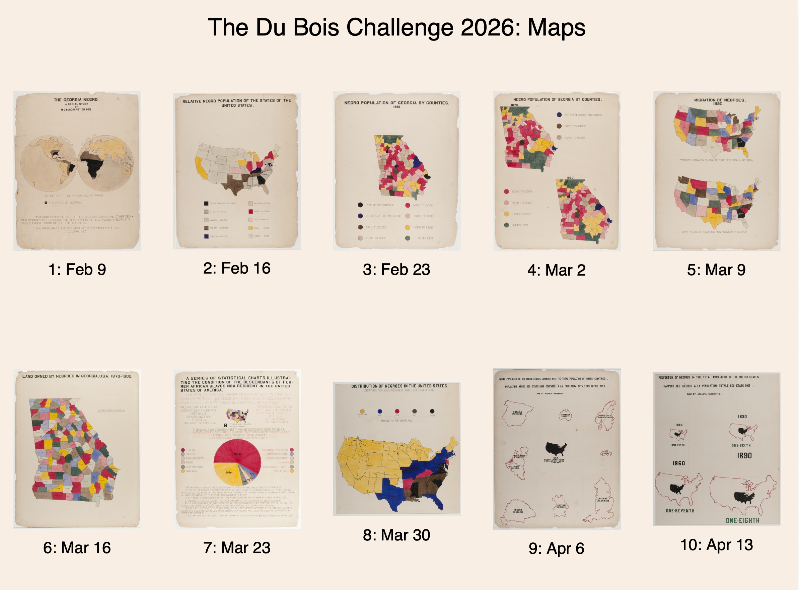

# Du Bois Visualization Challenge: 2026 Maps



The goal of the challenge is to celebrate the data visualization legacy of W.E.B Du Bois by recreating the visualizations from the 1900 Paris Exposition using modern tools.

This directory contains the data and original plates from the exposition; your goal is to re-create the visualizations using modern tools of your choice (Tableau, R, ggplot, Stata, PowerBI, decksh, etc)

There is a folder for each challenge, which includes the images of the 1900 original plates along with the corresponding data. You may submit your re-creations to social media using the hash tag ```#DuBoisChallenge2026```.

Note that for 2026, the challenge will occur on BlueSky, X, LinkedIn, Data Visualization Society Slack, as well as Mastadon on vis.social.


## The Challenges

A goal of Du Bois's exhibition in 1900 was to demonstrate the development Black Americans since emancipation in 1865. One hundred and twenty-six years later, in 2026, *this year's challenge will focus on the use of maps and geography* in the collection.

Each challenge has its own directory in this repository, including the original visual and associated data.

Note that each challenge directory contains data in CSV files, and geographic data as both [geojson](https://geojson.org/) and [shapefiles](https://www.esri.com/content/dam/esrisites/sitecore-archive/Files/Pdfs/library/whitepapers/pdfs/shapefile.pdf).

* [challenge01](https://github.com/ajstarks/dubois-data-portraits/tree/master/challenge/2026/challenge01): _The Georgia Negro_ (plate 01), February 9

	"The Georgia Negro, A Social Study" shows the transatlantic slave trade, with routes from Europe, Africa, the Americas and the Caribbean, highlighting Georgia. This visual contains Du Bois' famous assertion: "The problem of the 20th century is the problem of the color line"

* [challenge02](https://github.com/ajstarks/dubois-data-portraits/tree/master/challenge/2026/challenge02): _Relative Negro Population of the States of the United States_ (plate 02), February 16

	This map of the US shows the distribution of Black people at the turn of the twentieth century. Ranging from 75,000 and over in Georgia to less than 10,000 in the western states.

* [challenge03](https://github.com/ajstarks/dubois-data-portraits/tree/master/challenge/2026/challenge03): *Negro Population of Georgia by Counties, 1890* (plate 05), February 23

	This chart shows the Black population in the Georgia counties ranges from over 30,000 in the south east to under 1000 in the north and southern portions of the state.  The most prevalent category is in the 5-10,000 Black people distributed throughout the state.

* [challenge04](https://github.com/ajstarks/dubois-data-portraits/tree/master/challenge/2026/challenge04): *Negro Population of Georgia by Counties, 1870, 1880* (plate 06), March 2

	"Negro Population of Georgia by County", is a choropleth map with a alternating left-right pattern, comparing the population of Black Georgians in the years 1870 and 1890. Note the decrease of lightly populated areas, with the heavily populated areas in red shifting west.

* [challenge05](https://github.com/ajstarks/dubois-data-portraits/tree/master/challenge/2026/challenge05): *Migration of Negroes 1890* (plate 08), March 9

	The migration to and from Georgia to other the states of the US is shown in this visual.  The map shows how the state with a large Black population originated, and where they were dispersed to.

* [challenge06](https://github.com/ajstarks/dubois-data-portraits/tree/master/challenge/2026/challenge06): *Land Owned by Negroes in Georgia, USA, 1870-1900* (plate 20), March 16

	Land ownership was an indicator of economic and social development, as depicted in this choropleth of the state of Georgia shows.

* [challenge07](https://github.com/ajstarks/dubois-data-portraits/tree/master/challenge/2026/challenge07):  *A Series Of Statistical Charts Illustrating The Conditions Of Descendants Of Formal African Slaves Now Resident In The Unites States* (plate 37), March 23

	Serving as the introductory display, this chart shows the full Du Bois color palette. The chart includes bi-lingual text, a map of the Black population in the US, and a familiar pie chart showing professions in the population.

* [challenge08](https://github.com/ajstarks/dubois-data-portraits/tree/master/challenge/2026/challenge08): *Distribution of Negroes in the United States* (plate 38), March 30

	Yet another way to the distribution of Blacks in America, this chart uses number of people per square mile, ranging from 15-15 in southern states like Georgia and Mississippi, to less than 1 person/square mile in the west and upper mid-west.

* [challenge09](https://github.com/ajstarks/dubois-data-portraits/tree/master/challenge/2026/challenge09): *Population Comparison* (plate 41), April 6

	This chart of small multiples, compares the population of Blacks in America with various countries (Spain, Australia, Norway/Sweden, Belgium, the Netherlands, Switzerland, Hungary, Bavaria, and England).

* [challenge10](https://github.com/ajstarks/dubois-data-portraits/tree/master/challenge/2026/challenge10): *Population Proportions* (plate 42), April 13

	This chart shows the proportion of Blacks in total population of the US is compared from 1800 (one-fifth, 20%) to 1890 (one-eighth, 12.5%) The sizes are shown as superimposed maps: a land within another land.

## Collaboration with the Data Visualization Society

As a bonus, share your work in the [DVS Slack]( https://www.datavisualizationsociety.org/slack-community) for a chance to win either a one-year [DVS Membership](https://www.datavisualizationsociety.org/membership) (valued at $99) or a [Nightingale Magazine](https://shop.datavisualizationsociety.org/) (valued at $40).

There are two awards you could win:

1. *Challenge Contributor:* Submit your work in the [#challenge-dubois channel](https://datavizsociety.slack.com/archives/C04N7FZ1S82) to be entered into a raffle to win a printed copy of Nightingale, valued at $40. 1 raffle entry per participant, regardless of count of entries submitted.

2. *Top Contributor:* Awarded to participants who submit an entry for all 10 weeks of the challenge. If no one completes all 10 weeks, this recognition will go to the participant(s) who submitted the most entries. Those who meet this criteria will be given a Certificate, and have a raffle entry to win one year of DVS Plus Membership, valued at $99.

Here is a [form to register](https://docs.google.com/forms/d/1LW70K3p-nDUynOrj6i6rhrqs1PlwNAu_tTJbsIfEox4/edit?ts=6984a828) for the prizes.

Winners are announced at the end of the challenge.

Note: you need to be a [DVS Member](https://www.datavisualizationsociety.org/membership) to log into the DVS Slack. If you need assistance logging into Slack, contact assistant@datavisualizationsociety.org for support.


## References

To learn about how I re-created the visualizations using [decksh](https://speakerdeck.com/ajstarks/decksh-a-little-language-for-decks), see: [Recreating the Dubois Data Portraits](https://speakerdeck.com/ajstarks/recreating-the-dubois-data-portraits). This presentation contains the full catalog of re-creations at the end.

Also, here is a quick guide to the ["Duboisian" style](https://github.com/ajstarks/dubois-data-portraits/blob/master/dubois-style.pdf).

