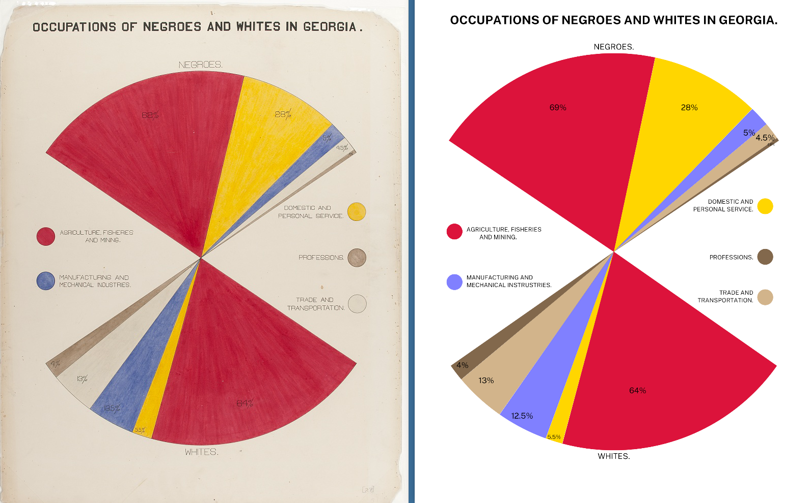

# Dubois Visualization Challenge



The goal of the challenge is to celebrate the data visualization legacy of W.E.B DuBois by recreating the visualizations from the 1900 Paris Exposition using modern tools.

This directory contains the data and original plates from the exposition; your goal is to re-create
the visualizations using modern tools of your choice (Tableau, R, ggplot, Stata, PowerBI, decksh, etc)

In this repo, there is a folder for each challenge, which includes the images of the 1900 original plates along with the corresponding data. You may submit your re-creations to twitter using the hash tag ```#DuBoisChallenge```

## The Challenges

* challenge01: Comparative Increase of White and Colored Population in Georgia
* challenge02: Conjugal Condition
* challenge03: Occupations of Negroes and Whites in Georgia
* challenge04: Proportion of Freeman and Slaves Among American Negroes
* challenge05: Income and Expenditure of 150 Negro Families in Atlanta, GA, USA
* challenge06: City and Rural Population 1890
* challenge07: Assessed Value of Household and Kitchen Furniture Owned by Georgia Negroes.
* challenge08: The Georgia Negro. A Social Study by W.E.Burghardt Du Bois
* challenge09: Migration of Negroes
* challenge10: Negro Population of Georgia by Counties

## References

To learn about how I re-created the visualizations using [decksh](https://speakerdeck.com/ajstarks/decksh-a-little-language-for-decks), see: [Recreating the Dubois Data Portraits](https://speakerdeck.com/ajstarks/recreating-the-dubois-data-portraits). This presentation contains the full catalog of re-creations at the end.

Also, here is a quick guide to the ["Duboisian" style](https://github.com/ajstarks/dubois-data-portraits/blob/master/dubois-style.pdf).

