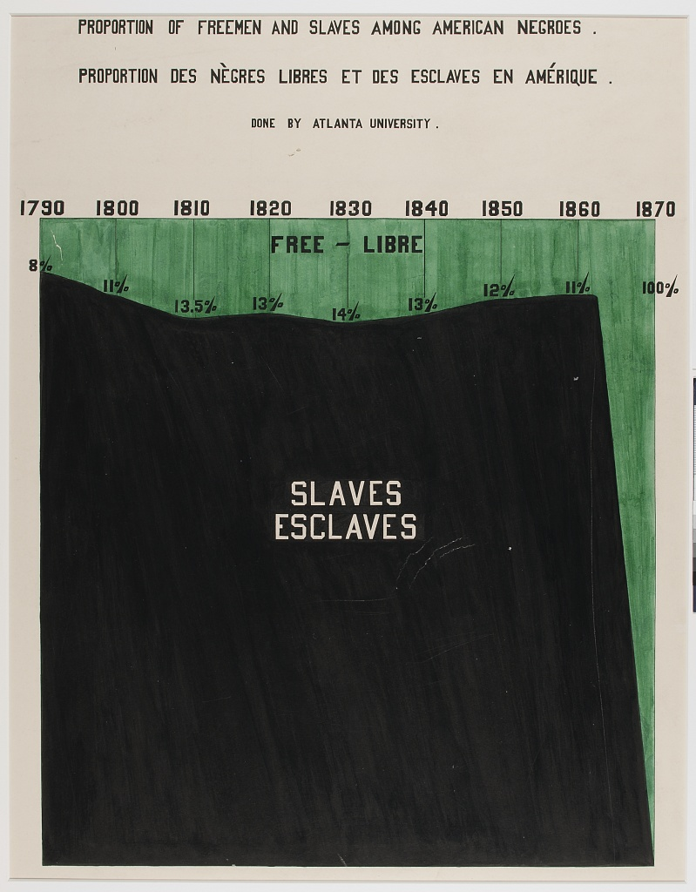
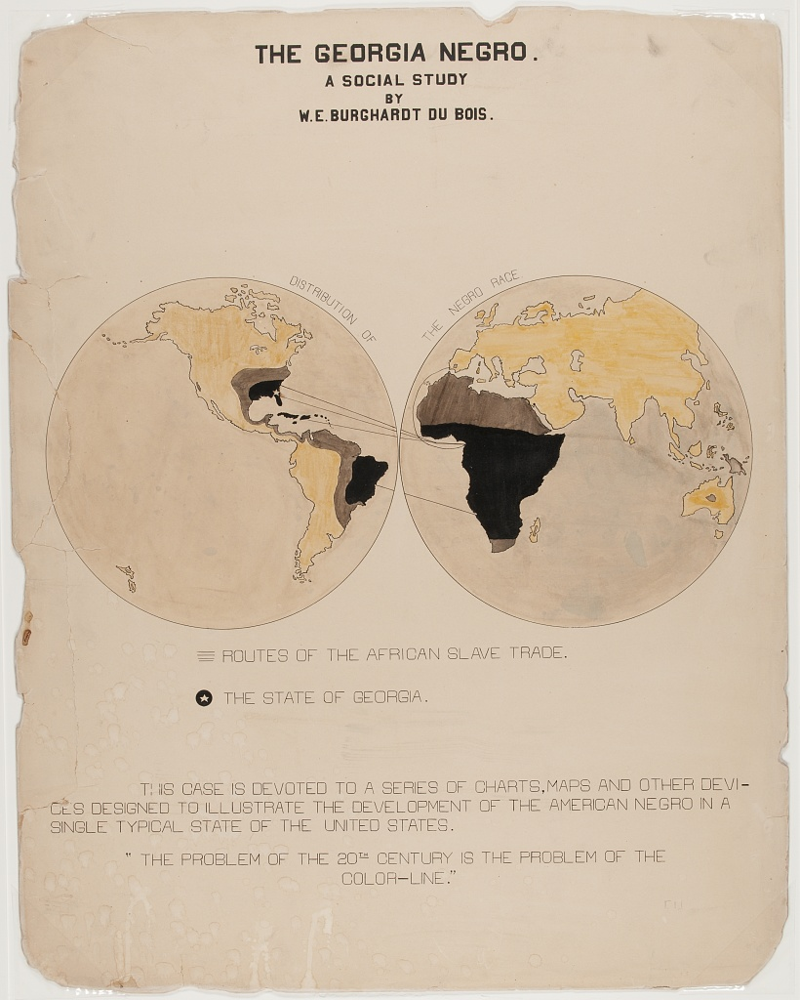
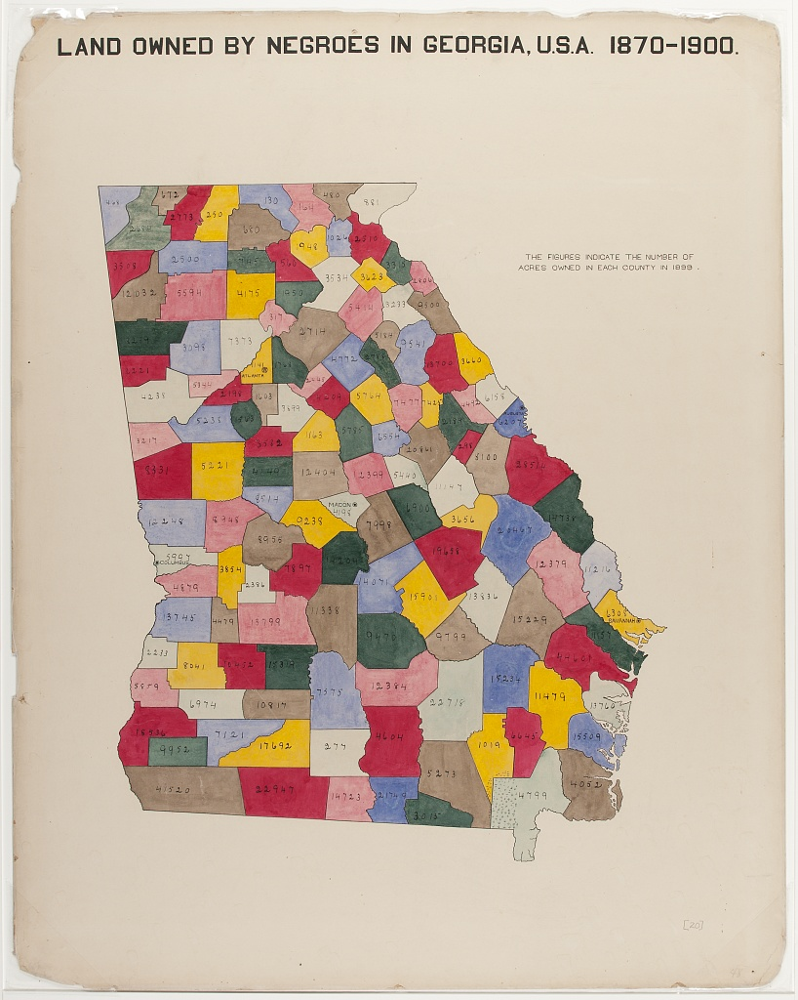

# Du Bois Visualizations for Consideration in STEM Education

(Note that the plate numbers referenced below are from [W. E. B. Du Bois's Data Portraits: Visualizing Black America](https://papress.com/products/w-e-b-du-boiss-data-portraits-visualizing-black-america)

## Figure 1: Time series graph

One of the rare line charts in the collection, the comparative population growth of white and Black Americans from 1790-1890, is annotated with relevant events like "Suppression of Slave Trade", Immigration" and  "Emancipation".

## Figure 2: Time Series Percent Area Graph

With the green waters of Freedom plunging down a waterfall set on the dark base of slavery, "Proportion of Freeman and Slaves Among American Negroes" shows number of enslaved and free from 1790 to 1870.

## Figure 3: Percentage Bar Graph of Dichotomous Variable Status (literacy) By Select Categories (National / Racial Community)

Comparing the state of Black Americans with the larger world, "Illiteracy of American Negroes compared with that of other nations" shows Black American's illiteracy in red, in the middle of a sea of green, higher than countries like France, but better than others like Russia.

## Figure 4: Categorical Map of Population Location With Population Size Legend

A choropleth outlining the population of Black Americans, by state. Note the concentration in the South, with Georgia leading (750,000 or more).

## Figure 5: Fan Chart for Categorical Percentage Distributions in Two Comparison Groups

The fan chart compares Black and white population's occupations, using color and area to faciliate comparisons.

## Figure 6: Cartographical Visualization of Population Location and Movement

"The Georgia Negro, A Social Study" shows the transatlantic slave trade, with routes from Europe, Africa, the Americas and the Caribbean, highlighting Georgia. This visual contains Du Bois' famous assertion: "The problem of the 20th century is the problem of the color line"

## Figure 7: Multivariate stacked bar graph by continuous covariate brackets, with photographic and other data element details

The horizontal stacked bar charts show how various economic groups
spend their income among these categories: Rent, Food, Clothes, Taxes, and 
other expenses and giving. This visual is distinct in that it includes photographs along with the chart.

## Figure 8: Partial Table Bar Graph – i.e. Bivariate Categorical Relationship (Marriage Status by Racial / National Group) Broken Out by Control Variable (Age)

 

The "Conjugal Condition" visual compares three groups (single, married, widowed and divorced), divided by age: (15-40, 40-80, and over 80) within two populations: Black Americans and the country of Germany.  The data is shown clearly using six proportional bar graphs in the red, yellow and green color scheme.

## Figure 9: Bar/Spiral chart
Uses color and contrasting lengths to highlight quantitative demographic differences.

## Figure 10: Bar Chart
"Acres of Land Owned by Negroes in Georgia" is a conventional bar chart with a twist. The chart shows the increase of land owned between 1874 (338,769 acres) and 1899 (1,023,741), with the red shape of the data echoing the map of Georgia.  

## Figure 11: County-level Choropleth
Echoing the previous chart, this map shows land owned by the formally enslaved over three decades post-emancipation.

## Figure 12: Spiral Chart
"Assessed Value of Household and Kitchen Furniture Owned by Georgia Negroes" uses the spiral form to emphasize the gains in material goods over a quarter century.

## References

[Du Bois Visualization Style Guide](https://github.com/ajstarks/dubois-data-portraits/blob/master/style/dubois-style.pdf)

