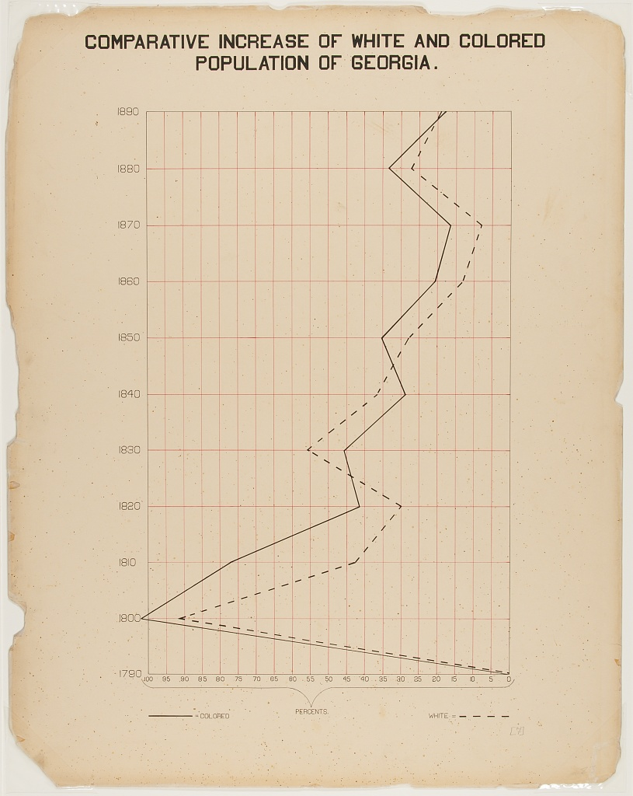
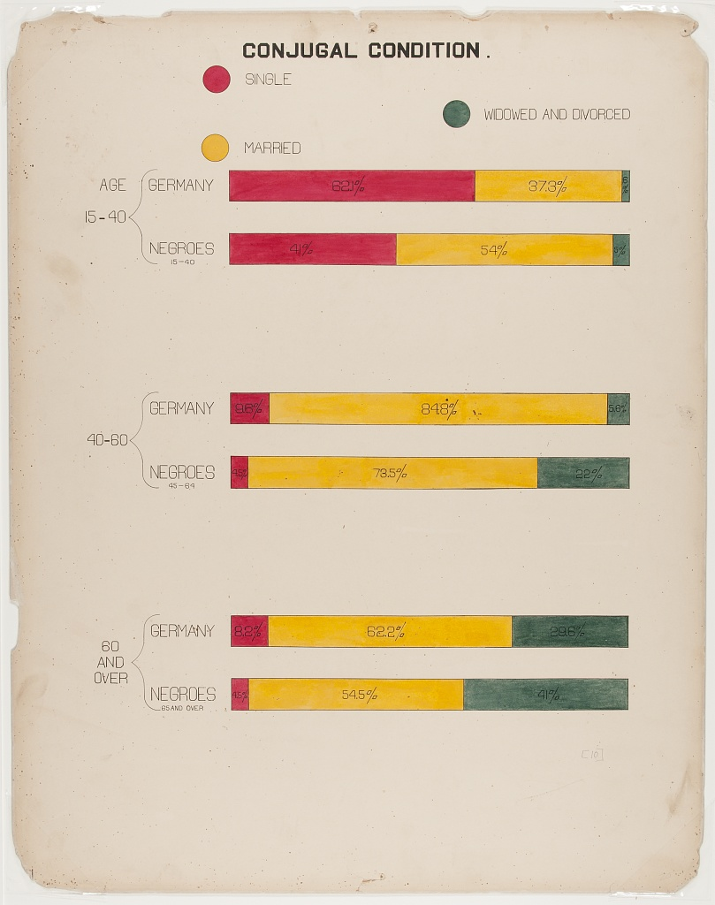

# Du Bois Visualizations for Consideration in STEM Education

(Note that the plate numbers referenced below are from [W. E. B. Du Bois's Data Portraits: Visualizing Black America](https://papress.com/products/w-e-b-du-boiss-data-portraits-visualizing-black-america)

## Visual01 (plate 31)

The horizontal stacked bar charts show how various economic groups
spend their income among these categories: Rent, Food, Clothes, Taxes, and 
other expenses and giving. This visual is distinct in that it includes photographs along with the chart.

## Visual02 (plate 18)

This fanciful chart uses literal bags of cash to depict the amount of land owned by Black Georgians. Starting in 1875, the value increase over 3 times by the end of century to $4,220,120

## Visual03 (plate 03)

This chart compares city and rural populations. The city populations range from 2.5-5K, 5K-10K, and over 10K. in 1890, the majority of people resided rural country and village areas, shown here as a tightly wound red spiral in contrast to the angled, connected city populations.

## Visual04 (plate 38)

This map shows the distribution of Black Americans. Heavy concentrations are in the South (largest in S. Carolina, Mississippi, Virginia). The mid-west and northeast is more sparely populated, with the west and extreme north showing < 1 person/sq. mile.

## Visual05 (plate 57)

Using boldly colored blocks, this abstract visual shows the varied businesses run by Black men. Including mercantile, grocers (the largest, shown as a large gold block), building contractors, druggists, and bankers.  The total estimated capital of $8.7 million ($282.6 today).

## Visual06 (plate 60)

The jauntily tilted stacked bar chart shows the categories of crime among the Black American population (property crime is the highest, gov't the lowest). The incident of prisoners is 3,250/million (compared to 1501/100,000 today).

## Visual07 (plate 27)

"Occupations of Negroes and Whites in Georgia" is not quite an pie chart, but a "fan chart", comparing the occupations of two groups. The chart is a good example of the typical Du Bois color palette.

## Visual08 (plate 40)

One of the rare line charts in the collection, the comparative population growth of white and Black Americans from 1790-1890, is annotated with relevant events like "Suppression of Slave Trade", Immigration" and  "Emancipation".

## Visual09 (plate 43)

A trio of stacked bar charts in the vibrant Du Bois colors, shows the occupations that Black Americans were engaged in, by gender. (compare this to plate 27).

## Visual10 (plate 8)

Prior to the "Great Migration" that would begin in 1910, this map shows the places Georgia-born Black people migrated to, along with the migration of them to other parts of the country.

## Visual11 (plate 2)

A choropleth outlining the population of Black Americans, by state. Note the concentration in the South, with Georgia leading (750,000 or more).

## Visual12 (plate 5)

Another choropleth focusing on the Black population within the State of Georgia/

## Visual13 (plate 7)

Continuing the theme of using Georgia as a exemplar, this line graph shows the comparative increase of the Black and White population in Georgia.  This chart is notable in that it reverses the modern convention, using time for the Y-axis and the data for the X

## Visual14 (plate 10)

The "Conjugal Condition" visual compares three groups (single, married, widowed and divorced), divided by age: (15-40, 40-80, and over 80) within two populations: Black Americans and the country of Germany.  The data is shown clearly using six proportional bar graphs in the red, yellow and green color scheme.

 