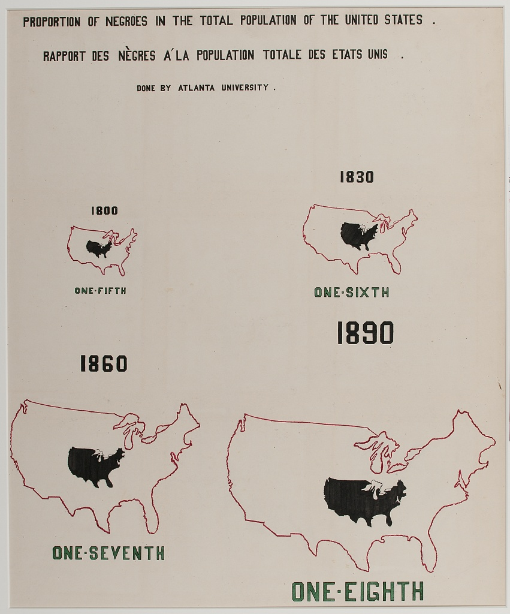
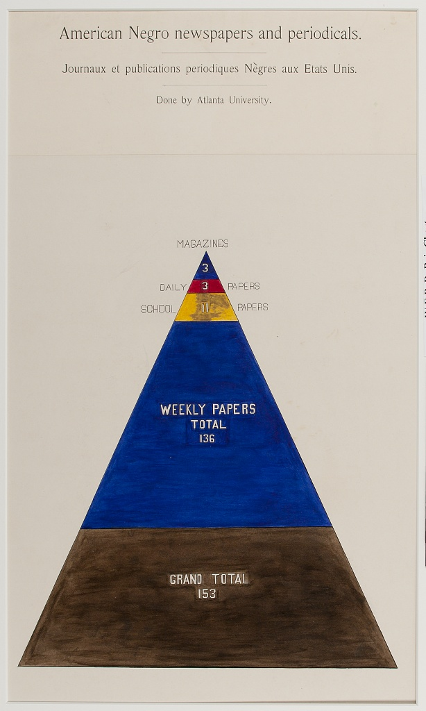
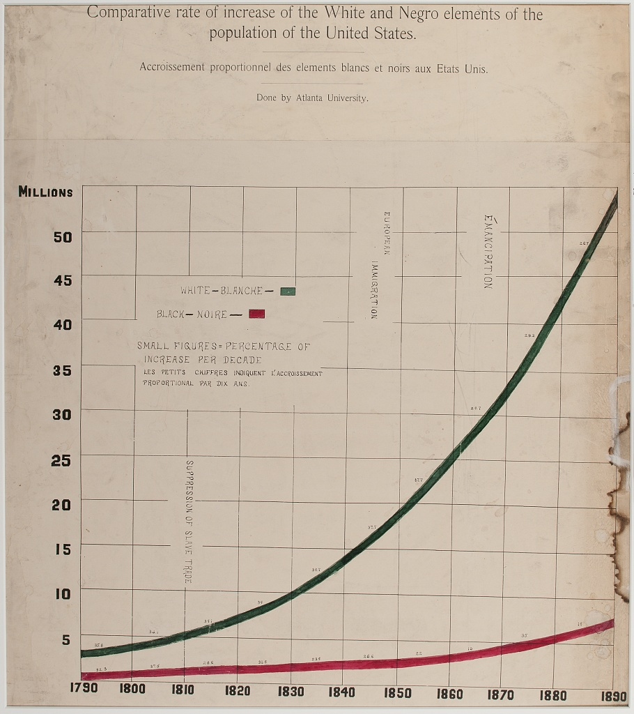

# What is a Dubois-style visualization?

Anthony Starks (ajstarks@gmail.com)

## Introduction

To help designers, artists, developers, and scholars seeking to implement or study the "Dubois Style", this document describes aspects of the visualizations created by  W. E. B Dubois' team for the 1900 Paris exposition.

To learn more see "W.E.B Dubois's Data Portraits Visualizing Black America" by Whitney Battle-Baptise and Britt Rusert (ISBN-978-1-61689-706-2) and the Library of Congress collection ["African American Photographs Assembled for 1900 Paris Exposition"](https://www.loc.gov/collections/african-american-photographs-1900-paris-exposition/about-this-collection/)

The sources above use plate numbers to indicate the visuals, this document users the same convention.

## Taxonomy

The approximately 60 visuals produced for the 1900 Exposition fall into these categories: bar charts (30), maps (9), visuals with circular features (7), visuals using large blocks of color (8), and line graphs (3). The visuals also use bold primary colors and abstract forms prior to modernist movements developed later in the twentieth century.

## Bars

The most prevalent type of visualization are bar charts. Some are conventional bar charts (mostly horizontal bars) with labels on the left, using a single color, with the values sorted. Red tends to be the dominate color for this type, although other colors like gray, yellow and green are also used. In one case the bars echo the shape of its subject -- the state of Georgia (plate 19)

There is three cases (plates 17, 26 and 62) where a bar is wrapped spanning 2-3 vertical lines. This use of wrapping is echoed in spirals described below.

Another unconventional use of bar is a "woven" pattern of two contrasting colors (indicating two cities, plate 23.). The weave is used in plate 14 where the timeline is woven with the measure of literacy.

Another type uses 1-3 vertical bars to describe proportion indicated by 2-3 solid colors (plate 13). In one case, plate 60, the bar is tilted 45 degrees.

## Maps

The second most prevalent type of visual is the map -- the majority of these use US state or Georgia county boundaries filled with color indicating some measure such as population distribution (plates 2, 5, 6, and 8). The maps include colored legends with circles of color to denote the categories. 

The political outlines may also be labeled with other indicia such as arrows and measures. (plates 8, 20) Two of the maps use filled and outline shapes to compare the US with other countries.

## Circles

Several charts use circular elements; notable are the spirals in plates 11 and 25 (plate 25 is on the cover of the book cited above and often shown when showing the Dubois visuals). The spirals are used to indicate large measures; instead of stretching out the lines as in a conventional bar chart, the measures are "rolled up in a spiral".

Another use of circles include conventional pie charts (plate 37), and the not quite pie "wedge" chart (plates 27, 44). Finally, a novel "target chart"  uses concentric circles with wedge-shaped pointers to the center.

## Blocks

Bold blocks of color are used in several charts, for example, area graphs in plates 51, 53, 54:

Some visuals use geometric (rectangular, triangular, pyramidal) blocks (plates  57, 55, 61)

## Graphs

Only three of the visuals use the traditional line chart. Two of the three use red grid lines (plates 7, 21). Plate 7 in unusual in that the date is the y axis and the measure is the x.

# Dimensions

In the context of the Paris exposition, the Dubois visualizations were large format, 22x28 inch posters, mostly in portrait orientation. (exceptions include plates 30 and 31). To duplicate this layout use a aspect ratio of approximately 0.78 (portrait) or 1.27 (landscape). For example setting your canvas to 1584x2016 pixels, at 72 pixels/inch, will duplicate the original canvas. Alternatively smaller sizes can be used preserving the aspect ratio. 

# Typography

Each visual includes a title: typically hand-lettered, sans-serif bold, centered all-caps with a period at the end. The titles may span 2-3 lines and its size of typically 3%-4% if the overall width. In some cases a typeset title is used using a serif font.

<image src="images/orig-title.png">

Many visualizations include commentary and annotations, which are typically done in a lighter weight and color. All text is in ALL-CAPS.

<image src="images/orig-note.png">

To duplicate using modern tools, [Public Sans](https://public-sans.digital.gov/) and [Charter](https://practicaltypography.com/charter.html) can be used for sans-serif and serif fonts.  Other choices are [B52-ULC W00](https://www.onlinewebfonts.com/download/3e5270c9b750bc1dc12f033a0e55864d) for titles and [Vasarely-Light](https://befonts.com/vasarely-font-family.html) for running text.

# Colors

The use of bold solid colors is a characteristic of the DuBois style. Here are the colors in the Dubois palette:

|Name		|RGB				|Hex    |
|-----------|-------------------|-------|
|black		|rgb(0,0,0)			|#000000|
|brown		|rgb(101,67,33)		|#654321|
|tan		|rgb(210,180,140)	|#d2b48c|
|gold		|rgb(255,215,0)		|#ffd700|
|pink		|rgb(255,192,203)	|#ffc0cb|
|crimson	|rgb(220,20,60)		|#dc143c|
|green		|rgb(0,128,0)		|#00aa00|
|blue		|rgb(70,130,180)	|#4682b4|

<image src="images/colors.png">

Note the use the Pan-African colors red (crimson), yellow, green, and black in this set.

The black, brown, and gold are used to indicate racial makeup in plates 1, 13 and 54. Plates 12, 50 and 51 use black to indicate slavery.