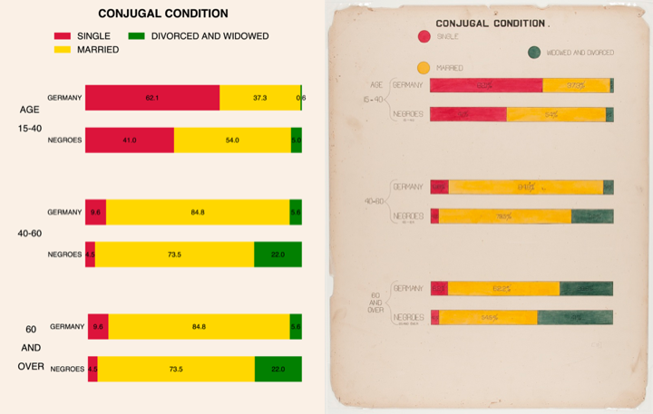
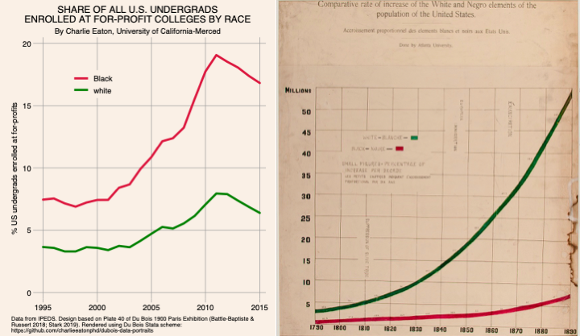

# Stata Du Bois Scheme

You can install the **dubois** Stata scheme on any machinge using the **ssc install dubois** command. After installation, get tips and help documentation using the **help dubois** command. The **scheme-dubois.scheme** file automates some parts of graphing in Stata to use the same style as the 1900 data portraits of Black America by W.E.B. Du Bois and his collaborators (Battle-Baptiste & 
Russert 2018; Stark 2019). These style elements include:
* aspect ratio of 0.78 (portrait) or 1.27 (landscape) consistent with the large format 22x28 inch portrait oriented posters of the Du Bois 1900 Paris exposition.
* The use of bold solid colors is a characteristic of the DuBois style. Here are the colors in the Du Bois palette: black, brown, tan, gold, pink, crimson, green, blue, often employing the Pan-African combination of red (crimson), yellow (gold) , green, and black.
* linen color background "250 240 230"
* grey gridlines for two dimensional line and area plots

To use the Du Bois scheme, you need to add the **scheme-dubois.scheme** file to your “ado” directory files in Stata. On a Mac, the file path for the scheme (“s”) folder where you should add the **scheme-dubois.scheme** file is /Applications/Stata/ado/base/s/. Eventually, we hope to publish the scheme in the Statistical Software Components (SSC) archive so that the scheme can be installed using the ssc install command.

Once you’ve added the **scheme-dubois.scheme** file to your folder, you can use the scheme within Stata in one of two ways:
* **set scheme dubois** sets the Du Bois scheme as your scheme for your entire Stata session.
* adding the specification **scheme(dubois)** to any graph command will render the graph using the Du Bois scheme

Many elements of the Du Bois style cannot be automated with a Stata scheme file. For example, graph fonts cannot be controlled via a Stata scheme. To illustrate how to implement other elements of Du Bois style, this repository includes use cases for recreating original Du Bois data portraits and for creating visualizations of contemporary social data and relations in the Du Boisian style. The use cases are provided as Jupyter Notebooks containing both Stata code and graphs. For those who do not use Jupyter Notebooks, Notebooks can easily be viewed by copying and pasting the GitHub url for any Jupityr Notebook into the NBviewer: https://nbviewer.jupyter.org. The three initial use cases with notebooks are:
* Du Bois' original Plate 10 "Conjugal Condition" by race and age poster **duboischallenge2.ipnyb**, viewable below. 
* For-profit college enrollment by race **duboisforprofitenrollments.ipynb**, viewable at: https://nbviewer.jupyter.org/github/charlieeatonphd/dubois-data-portraits/blob/master/statascheme/duboisforprofitenrollments.ipynb
* Student debt and the hidden racial wealth gap **studentdebthiddenracialwealthgap.ipynb**, viewable at: https://nbviewer.jupyter.org/github/charlieeatonphd/dubois-data-portraits/blob/master/statascheme/studentdebthiddenracialwealthgap.ipynb

The **duboischallenge2.ipnyb** Notebook recreates Du Bois' Plate 10 "Conjugal Condition" poster (right):

The **duboisforprofitenrollments.ipynb** Notebook plots for-profit college enrollments by race (left) based on the Du Bois' design of Plate 40's plot of the U.S. population by race from 1790 to 1890:

One of the most important style elements that cannot be controlled by a Stata scheme is fonts. Anthony Starks and others have noted that Public Sans closely resembles the original Du Bois font. Adding less common fonts like this to Mac OS Font Book can be challenging for novices. Among the factory installed Mac fonts, Tahoma is closest to that used by Du Bois, especially when key elements like main titles are written with all caps. To set your graphing font to Tahoma in Stata, use the following lines of code which are also found in the Jupyter Notebook use cases:
* graph set svg fontface Tahoma
* graph set eps fontface Tahoma
* graph set ps fontface Tahoma

If you discover ways to improve or expand on the Stata scheme or other Stata graphing specifications, please submit an issue or contact us in the Discussions tab of our repository here: https://github.com/charlieeatonphd/dubois-data-portraits/discussions

Thanks!!!

**Citations**
* Library of Congress collection "African American Photographs Assembled for 1900 Paris Exposition": https://www.loc.gov/collections/african-american-photographs-1900-paris-exposition/about-this-collection/ 
* "W.E.B Dubois's Data Portraits Visualizing Black America" (2018) by Whitney Battle-Baptise and Britt Rusert (ISBN-978-1-61689-706-2): https://www.amazon.com/W-Boiss-Data-Portraits-Visualizing/dp/1616897066.
* “What is Dubois-Style Visualization?” (2019) by Anthony Starks. https://github.com/ajstarks/dubois-data-portraits/blob/master/dubois-style.md